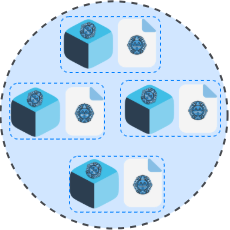

<p align="center">
  
</p>

<div align=center>
	<h1>MictlanX <span style="font-weight:normal;"> Client</span></h1>
</div>
<p align="center">
  <!-- Choose one: PyPI or TestPyPI -->
  <a href="https://test.pypi.org/project/mictlanx/">
    
  </a>
  <a href="./LICENSE">
    
  </a>
  <a href="./mictlanx/apac/LICENSE">
    
  </a>
  <a href="https://codecov.io/gh/jub-ecosystem/mictlanx-client">
    
  </a>
  
  
</p>

<!-- #  MictlanX  -->

**MictlanX Client** is a Python SDK for a decentralized, router-backed object storage system.  
It lets you PUT/GET large objects reliably across a pool of storage peers through one or more routers, handling chunked transfers, concurrency, retries, and integrity checks for you.

**Highlights**
- **Chunked uploads/downloads** for large files with bounded memory use.
- **Concurrent I/O** for higher throughput.
- **Router-aware**: work with one or many routers; easy to rotate or fail over.
- **End-to-end integrity**: SHA-256 checksum verification on writes/reads.
- **Metadata & tags**: attach and query key/value tags per object (ball) and bucket.
- **Client-side caching** to speed up repeated reads.
- **Bucket/Ball API**: an exception-raising, cache-backed layer (`mictlanx.objects`) for everyday use.
- **Access stats**: local per-ball counters and a decayed access frequency (`client.stats`).
- **Local VSS from Python**: deploy and elastically scale a router + peers with Docker (`mictlanx.vss`).
- **Simple API & examples** to get productive fast.

> MictlanX Client targets object storage use cases (store, fetch, list, and replicate objects).  
> It’s alpha software—interfaces may evolve between minor versions.

📖 **Documentation:** https://jub-ecosystem.github.io/mictlanx-client


## Table of contents

- [Prerequisites](#prerequisites-)
- [Installing extras](#installing-extras-)
- [Conceptual Architecture](#conceptual-architecture)
  - [Data granularity](#data-granularity)
  - [1. Peer](#1-peer)
    - [Basic PUT / GET (step by step)](#basic-put--get-step-by-step)
      - [1. Import and create a peer](#1-import-and-create-a-peer)
      - [2. Prepare what youll store](#2-prepare-what-youll-store)
      - [3. PUT step 1 - Send metadata](#3-put-step-1---send-metadata)
      - [4. PUT step 2 - Upload the bytes](#4-put-step-2---upload-the-bytes)
      - [5. step 3 - Download data and metadata](#5-step-3---download-data-and-metadata)
    - [Basic Storage Units](#basic-storage-units)
    - [Grouping balls](#grouping-balls-)
    - [Example: Video/GIF - Each frame is a ball](#example-videogif---each-frame-is-a-ball)
    - [Example: Video/GIF - Download frames](#example-videogif---download-frames)
  - [Router](#router)
    - [PUT & GET through the VSS](#put--get-through-the-vss)
      - [1) Define the Router and prepare the data and identifiers](#1-define-the-router-and-prepare-the-data-and-identifiers)
      - [2) Put metadata](#2-put-metadata)
      - [3. Put data](#3-put-data)
- [Getting started](#getting-started-)
  - [URI Format](#uri-format)
  - [Create a Client](#create-a-client)
  - [Configuration via environment variables](#configuration-via-environment-variables)
  - [1. Put](#1-put)
  - [2. Get](#2-get)
  - [3. Bucket/Ball API](#3-bucketball-api)
  - [4. Local VSS from Python](#4-local-vss-from-python)
- [Project Structure](#project-structure-)
- [Keypair generation (Optional)](#keypair-generation-optional)
- [Contributing](#contributing)
- [License](#license)
- [Contact](#contact)


## Prerequisites 

You must meet the prerequisites to run successfully the MictlanX Client:

1. Clone this repository to run the examples.

   ```sh
   git clone git@github.com:jub-ecosystem/mictlanx-client.git && cd mictlanx-client
   ```
2. Install poetry
    ```sh
    pip3 install poetry
    ```
3. Installing dependencies using the following command:

   ```sh
   poetry shell # Start the virtualenv
   poetry install # properly install the dependencies
   ```
4. *(Optional)* Create a directory for file logs. By default only the console is used — no files are written. To opt in to file logging:

   ```bash
   export MICTLANX_LOG_TO_FILE=1
   export MICTLANX_LOG_PATH=/mictlanx/client
   sudo mkdir -p $MICTLANX_LOG_PATH && sudo chmod 774 -R $MICTLANX_LOG_PATH && sudo chown $USER:$USER $MICTLANX_LOG_PATH
   ```
   ⚠️ Make sure to assign the right permissions
5. Deploy a peer (standalone version)
    ```sh
    chmod +x ./deploy_peer.sh && ./deploy_peer.sh
    ```
6. Deploy a router + replica manager + 2 peers:
    ```sh
    chmod +x ./deploy_router.sh && ./deploy_router.sh
    ```

  <!-- :warning: Make sure to assign the right permissions. -->

## Installing extras

MictlanX ships several optional dependency groups (Poetry "extras"). The base install (`poetry install`) covers the core client; install extras only if you need the feature they enable:

| Extra | Installs | Enables |
|---|---|---|
| `compression` | `lz4` | Chunk compression |
| `rich` | `rich` | Colored console log output (`MICTLANX_LOG_RICH=1`) |
| `tqdm` | `tqdm` | Progress bars in bulk operations (`AsyncClient.bulk_put`, etc.) |
| `progress` | `rich` + `tqdm` | Both of the above |
| `crypto` | `cryptography` | Keypair generation / encryption (see [Keypair generation](#keypair-generation-optional)) |
| `vss` | `docker` | Local test infrastructure via Docker (`deploy_peer.sh`, `deploy_router.sh`) |

With Poetry:
```sh
poetry install --extras "rich tqdm"
# or install every extra
poetry install --all-extras
```

With pip (from PyPI/TestPyPI):
```sh
pip install "mictlanx[rich,tqdm]"
# or combine several
pip install "mictlanx[progress,crypto,vss,compression]"
```


## Conceptual Architecture 

MictlanX exposes three progressively higher-level ways to talk to the storage layer:
1. **Peer** – talk directly to a storage peer. You create metadata and then upload the bytes. You can also fetch metadata and download the balls.

2. **Router** – talk to a router that manages one or more peers for you. The router handles placement, replication, and lookups.

3. **MictlanX Client** – a high-level client with retries, backoff, load balancing across routers, chunking, integrity checks, and a in-memory cache.


### Data granularity

In MictlanX, every payload you store—whether it starts as a memoryview, a file, or an object—is first segmented into fixed-size chunks (e.g., 256KB, 1MB). Each chunk is indexed (```0..N-1```) so it can be transmitted, retried, and verified independently. These chunks are then assembled into a “ball”, which is the logical object the system manages. A ball is identified by the pair ```(bucket_id, ball_id)``` and carries both metadata (size, checksum, content type, tags like fullname, extension, num_chunks, full_checksum) and data (the ordered set of chunks). Individual chunk keys follow the convention ```{ball_id}_{index}``` —for example, ```b1_0```, ```b1_1```, …—which makes random access and streaming straightforward.

Multiple balls live inside a bucket, which serves as the namespace and lifecycle boundary for related data. Buckets then reside within a Virtual Storage Space (VSS)—the execution domain that maps and replicates balls across storage peers. This layered design (chunks → balls → bucket → VSS) lets the client pipeline large objects efficiently, recover from partial failures with fine-grained retries, verify integrity end-to-end via checksums, and scale reads/writes across healthy peers without changing application-level semantics.

<div align="center">
  <div>
	
  </div>
  <div align="center">
	<span>Fig 1. Data granularity.</span>
  </div>
</div>

### 1. Peer
Use this when you want fine-grained control or are testing a single node. 
Assuming you have a compose file named ```mictlanx-peer.yml``` that brings up two peers on ```localhost:24000``` and ```localhost:24001```:

```bash
docker compose -f mictlanx-peer.yml up -d
# quick health checks (optional)
curl -fsS http://localhost:24000/health
curl -fsS http://localhost:24001/health 

# or 
chmod +x ./deploy_peer.sh && ./deploy_peer.sh
```

#### Basic PUT / GET (step by step)

#### 1. Import and create a peer

```python
 
from mictlanx.services import AsyncPeer

peer = AsyncPeer(
    peer_id     = "mictlanx-peer-0",
    ip_addr     = "localhost",
    port        = 24000,
    protocol    = "http",
    api_version = 4,
)
```

This points the client at a single peer at ```localhost:24000```. 
#### 2. Prepare what you'll store

```python
import hashlib

bucket_id = "mictlanx"          # logical namespace
ball_id = "b1"
key       = "hello-object"       # your logical object name
body      = b"Hello from AsyncPeer"
checksum  = hashlib.sha256(body).hexdigest()  # integrity guard
```

#### 3. PUT step 1 - Send metadata

This register the ball metadata (size, checksum, tags)
<div align=center>
  
</div>

```python
meta_res = await peer.put_metadata(
    key          = key,
    size         = len(body),
    checksum     = checksum,
    producer_id  = "client-0",
    content_type = "text/plain",
    ball_id      = ball_id,
    bucket_id    = bucket_id,
    tags         = {"fullname": "hello.txt", "extension": "txt"},
)

if meta_res.is_err:
    print("PUT_METADATA failed:", meta_res.unwrap_err())
    return

task_id = meta_res.unwrap().task_id
print("task_id:", task_id)

```
This example is implemented in ```examples/peer/01_put_metadata.py```.

You can run it directly from the CLI with your chosen arguments:
```bash
python3 examples/peer/01_put_metadata.py --bucket_id mictlanx --ball_id b1 --key hello-object
```


#### 4. PUT step 2 - Upload the bytes
Two-step PUT lets the server validate your metadata (size, checksum) before accepting data.

<div align=center>
  
</div>

```python
data_res = await peer.put_data(
    task_id=task_id,
    key=key,
    value=body,
    content_type="text/plain",
)

if data_res.is_err:
    print("PUT data failed:", data_res.unwrap_err())
    return

print("PUT completed")

```

This example is implemented in ```examples/peer/02_put_data.py```.

You can run it directly from the CLI with your chosen arguments:
```bash
python3 examples/peer/02_put_data.py --task_id=t-sdfF3f124f --key hello-object
```
⚠️ Remember to change the ```--task_id``` with the returned task_id from the put_metedata.


#### 5. step 3 - Download data and metadata

After you’ve uploaded a ball (PUT step 1-2), you typically consume it in two moves:

1. Fetch metadata (HEAD-equivalent): size, checksum, content-type, tags, etc.

2. Fetch data (GET): read bytes (optionally in chunks), then use them (write to file, print, process).

<div align=center>
  
</div>


```python
metadata = await peer.get_metadata(bucket_id=bucket_id, key=key)


data_res = await peer.get_streaming(bucket_id=bucket_id, key=key)

# body     = data_res.data

```
This example is implemented in ```examples/peer/03_get.py```.

You can run it directly from the CLI with your chosen arguments:
```bash
python3 examples/peer/03_get.py --bucket_id mictlanx --key hello-object
```

#### Basic Storage Units 
The figure shows how objects (balls) are represented inside the system:

- **Metadata**: A lightweight description of the ball. Think of it as the label on the ball.
- **Data**: The actual bytes of the ball. Can be streamed in ranges/chunks.
- **Ball**: A combination of Metadata + Data. This is the storage unit that lives in a bucket. Each ball is uniquely identified by its ```(bucket_id, ball_id)``` tuple.
- **Bucket**: A logical namespace that groups many balls together. Equivalent to a folder or container, identified by ```bucket_id```.
<div align=center>
  
</div>

### Grouping balls 🔵
Idea: many balls (objects) can share the same ball_id. That groups them into one logical unit (a set, a timeline, a version, etc.). Each ball still has its own key, metadata, and data.


A bucket stores many balls. If you reuse the same ball_id across several balls, they become a group:
- Each ball has its own ```key```, ```size```, ```checksum```, ```content_type```, and ```tags```.
- All balls with the same ```(bucket_id, ball_id)``` belong to the same collection.
- You can list/retrieve them by ```ball_id``` to process them together.
<div align=center>

<p>Fig. Group of balls by Ball ID.<p\>
</div>


#### Example: Video/GIF - Each frame is a ball

Represent a video (or GIF) as ```N``` balls that all share ```ball_id = "video123"```:
<div align=center>
  
  <p>Fig. Balls (Data + Metadata) storing frames of a Video/GIF.<p\>
</div>

Each ball = one frame:
- Data: The image bytes for that frame.
- Metadata: frame_number(ordering)

This example is implemented in ```examples/peer/04_put_frames.py```.

You can run it directly from the CLI with your chosen arguments:
```bash
python3 examples/peer/04_put_frames.py --bucket_id videos --ball_id video123 --frames_dir ./examples/data/frames
```

#### Example: Video/GIF - Download frames

Once the frames have been stored as balls with the same `ball_id`, you can retrieve them all together.  
The `get_by_ball_id` call returns the list of balls (frames) that belong to the group.  
You then sort them using the `frame_number` tag in their metadata and stream each frame in sequence.

<div align=center>
  
  <p>Fig. Downloading and rendering frames grouped by <code>ball_id</code>.<p>
</div>

**How it works:**
1. **Query by ball_id** → `peer.get_by_ball_id(bucket_id, ball_id)` returns all frame-balls.  
2. **Order frames** → sort them using the `frame_number` tag to preserve sequence.  
3. **Stream data** → fetch each frame’s bytes with `get_streaming`.  
4. **Preview** → display frames in order with a configurable delay (`--delay_ms`) or reconstruct into an animation.

This example is implemented in `examples/peer/05_get_frames.py`.

You can run it directly from the CLI:

```bash
python3 examples/peer/05_get_frames.py --bucket_id videos --ball_id video123 --delay_ms 40
```
**Notes:**
Some peer examples require GUI support to display frames using matplotlib. Even if all Python dependencies are installed, the script may fail to show frames if GUI libraries are missing.

Required packages (optional):
- Tkinter (Python GUI toolkit)
- Other system packages needed for GUI support depending on the environment

### Router
Use ```AsyncRouter``` when you want the router to choose a healthy peer (load balancing, retries, awareness of cluster state or replication) and operate the system as a ```Virtual Storage Space (VSS)``` . The API is intentionally very similar to ```Peer```. 


A VSS is the logical boundary formed by one router (or more, for HA) plus a set of storage peers. From the client’s point of view, a VSS behaves like one storage service—even though data is actually placed, replicated, and served by multiple peers behind the router.

What the Router does inside a VSS

- Peer selection & load-balancing: chooses a target peer for each request based on health and load.

- Retries & failover: transparently retries on other peers if a node is slow/unavailable.

- Cluster awareness: tracks which peers hold replicas and where to read/write.

- Policy hooks: can coordinate replication, placement, or future policies without changing client code.


<div align=center>
  
  <p>Conceptual representation architecture of a VSS.<p>
</div>


At the “global” or higher-level view of the system, a VSS is represented as a hexagon. Think of the hexagon as the logical boundary that groups:

- one (or more) Router(s) in front, and

- a pool of Storage Peers behind it,

so the VSS behaves like a single storage service to your applications.

<div align=center>
  
  <p>Conceptual representation of a VSS.<p>
</div>

Inside that hexagon, the Router decides which peer should handle a request, while Peers store and serve  balls inside buckets.


### PUT & GET through the VSS

- **PUT**: Client → Router → chosen Peer(s). Router validates metadata first (size/checksum) and then streams bytes to the selected peer. Replication can be triggered after the first successful write.

- **GET**: Client → Router → best Peer for that ball. Router picks a close/healthy replica and streams the data back to the client.

These examples assume you have a router running locally (e.g., from ```mictlanx-router.yml```) at ```http://127.0.0.1:60666``` and two test peers behind it.

#### 1) Define the ```Router``` and prepare the data and identifiers

```python
router = AsyncRouter(
    router_id   = "router-0",
    ip_addr     = "localhost",
    port        = 60666,
    protocol    = "http",
    api_version = 4,
    http2       = False,
)

bucket_id = "mictlanx"
ball_id   = "bx"                    # logical group
key       = "hello-object-router"          # this concrete object
body      = b"Hello from AsyncRouter"
checksum  = hashlib.sha256(body).hexdigest()
```

#### 2) Put metadata

```python
res = router.put_metadata(
  bucket_id    = bucket_id,
  ball_id      = ball_id,
  key          = key,
  size         = len(body),
  checksum     = checksum,
  producer_id  = "client-0",
  content_type = "text/plain",
  tags         = {"fullname": "hello.txt", "extension": "txt"},
)

if res.is_err:
    print("PUT_METADATA failed:", res.unwrap_err())
    return

tasks_ids:List[str] = res.unwrap().tasks_ids
```

This example is implemented in ```examples/01_router_put_metadata.py```.

You can run it directly from the CLI with your chosen arguments:
```bash
 python3 examples/router/01_put_metadata.py --bucket_id bk1 --ball_id b1 --key k1 --rf 1
```
**Note:** The ``--rf`` argument must be provided to indicate how many copies of the object or metadata should be stored across the peers in the distributed system.

### 3. Put data
Uploads the actual bytes using a task_id from step 2.

```python
body    = b"Hello from AsyncRouter"  # must match size/checksum sent in metadata
put_data_result = await router.put_data(
    task_id      = task_id,
    key          = key,
    value        = body,
    content_type = "text/plain",
)
```

This example is implemented in ```examples/02_router_put_data.py```.

You can run it directly from the CLI with your chosen arguments:
```bash
python3 examples/router/02_put_data.py --task_id <PASTE_TASK_ID> --key k1
```


## Getting started 🚀

```AsyncClient``` is the high-level, batteries-included interface: it talks to one or more Routers, picks a healthy one (load-balancing), streams data in chunks, applies retries + exponential backoff, and verifies integrity with SHA-256. It also provides convenience helpers such as ```put_file()``` and ```get_to_file()```.


### URI Format
```AsyncClient``` receives a single uri string and internally builds ```Router``` objects.
The format is parsed by ```MictlanXURI.parse()``` (shown below) and supports one or more routers.

- Scheme: ```mictlanx://```
- Routers list: comma-separated specs, each as ```router_id@host:port```. 
- Global query (applies to all routers): ```protocol```, ```api_version```, ```http2```.
- The first ```/``` or ```?``` separates the router list from the global query block. 

Canonical form (what ```MictlanXURI.build()``` produces):
```python
mictlanx://<router_id@host:port>[,<router_id@host:port>]/?protocol=<http|https>&api_version=<int>&http2=<0|1>
```

#### Examples
- Single local router:
```python
uri = "mictlanx://mictlanx-router-0@localhost:60666/?protocol=http&api_version=4&http2=0"
```
- Two routees HTTPS + HTTP/2
```python
uri = (
    "mictlanx://"
    "mictlanx-router-0@alpha.tamps.cinvestav.mx:443,"
    "mictlanx-router-1@beta.tamps.cinvestav.mx:443"
    "/?protocol=https&api_version=4&http2=1"
)
```
- Programmatically build a URI from ```AsyncRouter``` instances:
```python
from mictlanx.services import AsyncRouter
from mictlanx.utils.uri import MictlanXURI

routers = [
    AsyncRouter(router_id="mictlanx-router-0", ip_addr="localhost", port=60666, protocol="http", api_version=4),
    AsyncRouter(router_id="mictlanx-router-1", ip_addr="localhost", port=60667, protocol="http", api_version=4),
]
uri = MictlanXURI.build(routers)   # -> "mictlanx://mictlanx-router-0@localhost:60666,.../?protocol=http&api_version=4&http2=0"

```

⚠️ If you see ```ValueError: no routers```, you likely left an empty entry (e.g. trailing comma) or didn’t pass any routers before the query.


### Create a Client
⚠️ Before running the examples, you need a local Virtual Storage Space (one Router + a couple of Peers).
deploy_router.sh spins up that test stack with Docker Compose so the client has something to talk to.

How to deploy it: 
```sh
chmod +x ./deploy_router.sh && ./deploy_router.sh
```


```python
import asyncio
from mictlanx import AsyncClient

async def main():
    uri = "mictlanx://mictlanx-router-0@localhost:60666/?protocol=http&api_version=4&http2=0"
    client = AsyncClient(
        uri              = uri,
        client_id        = "client-0",
        debug            = True,     # console DEBUG logs
        eviction_policy  = "LRU",
        capacity_storage = "1GB",
        verify           = False     # set True or a CA bundle path for HTTPS
    )
asyncio.run(main())

```

### Configuration via environment variables

Every `AsyncClient` constructor parameter has a `MICTLANX_CLIENT_*` or `MICTLANX_LOG_*` env-var counterpart, so the client can be fully configured from the environment — no code change needed.

**Client:**

| Variable | Default | Purpose |
|---|---|---|
| `MICTLANX_CLIENT_URI` | **required** | `mictlanx://` router connection string |
| `MICTLANX_CLIENT_ID` | random hex | Client identity / logger name |
| `MICTLANX_CLIENT_DEBUG` | `1` | Echo log records to console |
| `MICTLANX_CLIENT_MAX_WORKERS` | `12` | Thread-pool upper bound |
| `MICTLANX_CLIENT_EVICTION_POLICY` | `LFU` | Cache strategy (`LFU` with decay, or `LRU`) |
| `MICTLANX_CLIENT_CAPACITY_STORAGE` | `1GB` | In-memory cache size (upper bound; memory is only used by cached objects) |
| `MICTLANX_CLIENT_CACHE_DEFAULT` | `0` | Whether `AsyncClient.get()` uses the cache when `cache=` is not passed |
| `MICTLANX_CLIENT_HALF_LIFE` | `10m` | Decay half-life of the access frequency (`client.stats`, LFU eviction) |
| `MICTLANX_CLIENT_VERIFY` | `0` | SSL verification (`0` = off, `1` = system CAs) |

**Logging:**

| Variable | Default | Purpose |
|---|---|---|
| `MICTLANX_LOG_PATH` | `.mictlanx/log` | Directory for rotating log files |
| `MICTLANX_LOG_DISABLED` | `0` | Set to `1` to suppress all output |
| `MICTLANX_LOG_LEVEL` | `DEBUG` | Minimum level (`DEBUG` / `INFO` / `WARNING` / `ERROR`) |
| `MICTLANX_LOG_RICH` | `0` | Set to `1` for syntax-coloured console output (requires `rich`) |
| `MICTLANX_LOG_JSON_INDENT` | `0` | Console JSON indentation (0 = compact, 4 = pretty) |
| `MICTLANX_LOG_TO_FILE` | `0` | Set to `1` to enable file logging (disabled by default) |
| `MICTLANX_LOG_ERROR_FILE` | `0` | Set to `1` to write a separate `.error.log` |

```bash
# Minimal — client reads everything from env
export MICTLANX_CLIENT_URI=mictlanx://mictlanx-router-0@localhost:60666/?protocol=http&api_version=4&http2=0
```

See [Environment Variables](docs/environment-variables.md) for the full reference.

#### 1. Put
The client cuts your payload into chunks, uploads them in parallel with retries, and stores the checksum in the object’s metadata for integrity verification later.

```python
client.put(bucket_id=bucket_id, key=key, value = data, tags ={},chunk_size = "1KB", )
```
This example is implemented in ```examples/client/01_put.py```.

You can run it directly from the CLI with your chosen arguments:
```bash
python3 examples/client/01_put.py \
  --bucket_id mictlanx \
  --ball_id hello-object \
  --path ./samples/hello.txt \
  --chunk_size 1MB \
  --tag content_type=text/plain
```

#### 2. Get
```AsyncClient.get()``` looks up the object’s metadata to discover how many chunks exist, downloads them in parallel with retries + exponential backoff, reassembles the bytes, and (by default) verifies integrity against the stored SHA-256.

```python
# fetch bytes back into memory
res = await client.get(
    bucket_id    = bucket_id,
    key          = key,        # the same logical id you used on PUT
    chunk_size   = "1MB",      # request size hint; peer may adjust
    max_retries  = 8,
    max_paralell_gets = 8,     # parallel chunk downloads
)

if res.is_ok:
    out = res.unwrap()         # AsyncGetResponse
    data = out.data.tobytes()  # assembled bytes
    metas = out.metadatas      # per-chunk metadata (list)
    print("got", len(data), "bytes")
else:
    print("GET failed:", res.unwrap_err())

```
If you prefer to write directly to disk (streamed, ordered), use ```get_to_file()```:

```python
path_res = await client.get_to_file(
    bucket_id     = bucket_id,
    ball_id       = key,       # same value as `key` above
    output_path   = "./downloads",
    fullname      = "hello.txt",  # optional; defaults from tags if present
    chunk_size    = "1MB",
)

if path_res.is_ok:
    print("saved to:", path_res.unwrap())
else:
    print("GET->file failed:", path_res.unwrap_err())

```

This example is implemented in ```examples/client/02_get.py```.

Run it from the CLI (works with the local stack started by ```deploy_router.sh```):

```sh
# bytes into memory (prints size)
python3 examples/client/02_get.py \
  --bucket_id mictlanx \
  --ball_id       hello-object \
  --chunk_size 1MB

# stream directly to a file
python3 examples/client/02_get.py \
  --bucket_id mictlanx \
  --ball_id       hello-object \
  --to_file \
  --outdir       ./downloads \
  --chunk_size 1MB
```

⚠️ ```--key``` must match the logical id you used on PUT.

`get()` does not cache by default. Pass `cache=True` (or create the client with `cache_default=True`) to keep the downloaded bytes in memory: the next `get()` costs one metadata request instead of a download, as long as the stored checksum hasn't changed. `force=True` always downloads.

#### 3. Bucket/Ball API
`mictlanx.objects` is a small, exception-raising layer on top of `AsyncClient`. Reads always go through the cache, and every ball exposes this client's access stats.

```python
from mictlanx import AsyncClient
from mictlanx.objects import Bucket, BallConflictError

async with AsyncClient(uri=URI) as mx:
    bk   = mx.bucket("bk1")                 # or Bucket("bk1") inside the `async with`
    ball = await bk.put("b1", b"hello", tags={"owner": "me"})   # -> Ball (metadata, no data)
    data = await bk.get("b1")               # -> bytes (cached)
    meta = await bk.get_metadata("b1")      # -> Ball

    print(ball.num_gets, ball.hits, ball.misses, ball.freq)   # local, live stats
    await ball.replicate(2)                 # replication = put the same data again

    try:
        await bk.put("b1", b"other data")   # balls are immutable
    except BallConflictError:
        ...

    async for b in bk.balls():              # list the bucket
        print(b.ball_id, b.size, b.tags)

    result = await bk.put_many([("a", b"1"), ("b", b"2")])     # result.ok / result.failed
```

- `freq` is a decayed score: roughly the recent gets per second, halving every `half_life` (default `10m`) without reads. `num_gets` is the lifetime count.
- Stats count only what this client did (puts and gets), are kept after cache eviction, and never touch the network.

See `examples/new_api/` for runnable scripts (quickstart, metadata/listing, access stats, cache behaviour, replication/conflicts, `put_many`, filters).

#### 4. Local VSS from Python
`mictlanx.vss.VirtualStorageSpace` deploys a complete local VSS (router + summoner + rm + a pool of peers) through the Docker Engine API, so you don't need `deploy_router.sh`. You can also grow or shrink the peer pool at runtime. It requires a running Docker daemon and the `vss` extra (`pip install "mictlanx[vss]"`).

```python
from mictlanx import AsyncClient
from mictlanx.vss import VirtualStorageSpace

async with VirtualStorageSpace(peers=2, vss_id="my-vss") as vs:   # up() on enter, down() on exit
    print(vs.size, vs.peer_ids())

    async with AsyncClient(uri=vs.uri) as mx:                      # vs.uri is a ready mictlanx:// URI
        bk = mx.bucket("bk1")
        await bk.put("b1", b"hello")
        print(await bk.get("b1"))

    await vs.expand(n=2)      # add 2 peers (alias: vs.elastic(n=2))
    await vs.retract(n=1)     # remove the most recently added peer (LIFO)
    print(await vs.stats())   # per-peer stats reported by the router
```

- `VirtualStorageSpace(...)` only stores the desired state. Containers are created by `up()`, `expand()` or entering `async with`.
- `async with` always tears the cluster down, even if the block raises.
- Methods return `Result`, like the rest of the SDK.

See `examples/vss/` for runnable scripts (deploy, elastic scaling, context manager).


## Project Structure 📂

```bash
.
├── CHANGELOG.md                  # Release notes (latest tracked: 0.1.0a0)
├── CODE_OF_CONDUCT.md            # Community standards
├── CONTRIBUTING.md               # How to contribute
├── Dockerfile                    # Base image for building/running the client
├── LICENSE                       # GPL-3.0-only (see NOTICE.md for dual-license details)
├── NOTICE.md                     # Dual-license summary
├── README.md                     # This document
├── SECURITY.md                   # Security reporting policy
├── build.sh                      # Local build helper (wheel/sdist, etc.)
├── clean_dist.sh                 # Clean dist artifacts
├── deploy_peer.sh                # Helper to run a peer with env/flags (local/dev)
├── deploy_router.sh              # Helper to run a router with env/flags (local/dev)
├── docs/                         # MkDocs site (source)
│   ├── api-reference/            # Auto-generated API docs (AsyncClient, peers, errors…)
│   ├── assets/
│   ├── architecture.md
│   ├── getting-started.md
│   ├── index.md
│   ├── prerequisites.md
│   └── use-cases.md
├── examples/                     # Minimal, runnable examples
│   ├── client/                   # AsyncClient examples (put/get, files, metadata)
│   ├── data/                     # Sample assets for examples
│   ├── new_api/                  # Bucket/Ball API examples (mictlanx.objects)
│   ├── peer/                     # AsyncPeer examples (direct to peer)
│   ├── router/                   # AsyncRouter examples (LB, retries)
│   ├── use-cases/                # Higher-level scenarios
│   └── vss/                      # VirtualStorageSpace examples (deploy, elastic scaling)
├── mictlanx/                     # Python package (flattened layout)
│   ├── __init__.py
│   ├── apac/                     # (Reserved) Availability/Policy/Control modules
│   ├── asyncx/                   # Async helpers: load balancer, async utils
│   ├── caching/                  # CacheFactory & in-memory stores (LRU, etc.)
│   │   └── stats.py              # AccessStats: local per-ball counters + decayed frequency
│   ├── errors/                   # Typed exceptions & error helpers
│   ├── interfaces/               # Typed dataclasses/DTOs (Peer, Router, Metadata…)
│   ├── ipc/                      # Client<->service contracts & envelopes (if any)
│   ├── logger/                   # Structured logging utilities
│   ├── objects/                  # Bucket/Ball handles (exception-raising, cache-backed)
│   ├── retry/                    # RetryPolicy, raf() (exponential backoff/jitter)
│   ├── services/                 # AsyncPeer / AsyncRouter client implementations
│   ├── types/                    # Common type aliases (e.g. VerifyType)
│   ├── utils/                    # Utilities (URI parser, chunking, compression, etc.)
│   └── vss/                      # VirtualStorageSpace: deploy/scale a local VSS via Docker
├── mictlanx-peer.yml             # Docker Compose: 1+ peers (localhost)
├── mictlanx-router.yml           # Docker Compose: 1 router + 2 peers (localhost)
├── mkdocs.yml                    # Docs site config (MkDocs Material, nav, theme)
├── poetry.lock                   # Locked deps (Poetry)
├── publish.sh                    # Publish helper (testpypi/pypi)
├── pull_request_template.md      # PR checklist/template
├── pyproject.toml                # Project metadata & dependencies
├── requirements.txt              # Runtime deps (pip install -r)
├── run_docs.sh                   # Serve docs locally (mkdocs serve)
├── zensical.toml                 # Docs site config (Zensical: nav, theme, mkdocstrings)
├── scripts/
│   └── gen_ref_pages.py          # Script to generate API ref pages into docs/
└── tests/                        # Pytest suite (unit/integration)
    ├── test_chunks.py            # Chunking/segmentation tests
    ├── test_compression.py       # Compression roundtrips
    ├── test_delete.py            # Delete-by-key / delete-ball flows
    ├── test_get_async.py         # Async GET streaming & integrity checks
    ├── test_get_bucket.py        # Bucket metadata aggregation
    ├── test_get_metadata.py      # Single object metadata fetch
    ├── test_peer.py              # AsyncPeer smoke tests
    ├── test_put.py               # PUT (bytes/file/chunks)
    ├── test_raf.py               # Retry-After-Function helpers
    ├── test_router.py            # AsyncRouter APIs
    ├── test_router_lb.py         # Router LB selection behavior
    ├── test_summoner.py          # (Reserved/module tests)
    ├── test_uri.py               # MictlanXURI parsing/building
    ├── test_utils.py             # Generic utilities
    ├── test_cache.py             # Cache public interface (LRU/LFU)
    ├── test_cache_edge_cases.py  # Cache edge cases
    ├── test_new_api_cache.py     # Bucket/Ball API + cache behaviour
    └── test_vss.py               # VirtualStorageSpace

```

### Keypair generation (Optional)
To  create tour keypair you can use the next code, but take into account that the default output path of the keypair generator is ```mictlanx/xolo/.keys``` you can change it if assign a different value to the env ```XOLO_SECRET_PATH``` for example:

```sh
export XOLO_SECRET_PATH = /another/path
```

```py
from xolo.utils.utils import Utils as XoloUtils

bob_keypair = XoloUtils.X25519_key_pair_generator("bob")
# in another computer
alice_keypair = XoloUtils.X25519_key_pair_generator("alice")
```

Now you can create a shared secret and use it to encrypt the data:

```py
    bob_priv = XoloUtils.load_private_key(filename="bob").unwrap()
    alice_pub = XoloUtils.load_public_key(filename="alice").unwrap()
    shared_key = bob_priv.exchange(peer_public_key=alice_pub)
```


<p align="right">(<a href="#top">back to top</a>)</p>


## Contributing

Contributions are what make the open source community such an amazing place to learn, inspire, and create. Any contributions you make are **greatly appreciated**.

If you have a suggestion that would make this better, please fork the repo and create a pull request. You can also simply open an issue with the tag "enhancement".
Don't forget to give the project a star! Thanks again!

1. Fork the Project
2. Create your Feature Branch (`git checkout -b feature/AmazingFeature`)
3. Commit your Changes (`git commit -m 'Add some AmazingFeature'`)
4. Push to the Branch (`git push origin feature/AmazingFeature`)
5. Open a Pull Request

<p align="right">(<a href="#top">back to top</a>)</p>

<!-- LICENSE -->

## License

The main client (`mictlanx/`, excluding `mictlanx/apac/`) is distributed under the
**GNU General Public License v3.0**. See [`LICENSE`](LICENSE) for the full terms.

The APaC Core (`mictlanx/apac/`) is governed by a proprietary End-User License Agreement.
See [`mictlanx/apac/LICENSE`](mictlanx/apac/LICENSE). Commercial use requires a written
agreement — contact ignacio.bcastillo@gmail.com.

<p align="right">(<a href="#top">back to top</a>)</p>

<!-- CONTACT -->

## Contact

Ignacio Castillo - [@NachoCastillo]() - jesus.castillo.b@cinvestav.mx

<p align="right">(<a href="#top">back to top</a>)</p>
